# Transport

## Client architecture

### Essences

```go
// Data - data to be sent.
type Data unsafe.Pointer

// ShardedData - array of structures (*LabelSet, timestamp, value, LSHash)
type ShardedData unsafe.Pointer

// Segment - encoded data segment.
type Segment []byte

// Redundant - information to create Snapshot.
type Redundant unsafe.Pointer

// Snapshot - snapshot of encoder/decoder.
type Snapshot []byte

// SegmentKey - key to store segment in Exchange and Refill.
type SegmentKey struct {
    ShardID uint16
    Segment uint32
}

// AckStatus - numbers of last confirmed segments by shards and destinations.
type AckStatus interface {
    Ack(key SegmentKey, dest string)
    Last(shardID uint16, dest string) uint32
}

+--------------------------------+
|              Frame             |
|+------------------------------+|
||             Header           ||
|+------------------------------+|
||            11 byte           ||
||      1 typeFrame uint8       ||
||      2 shardID uint16        ||
||      4 segmentID uint32      ||
||      4   size uint32         ||
|+------------------------------+|
|+------------------------------+|
||             Body             ||
|+------------------------------+|
||             Title            ||
|+--------------or--------------+|
||       DestinationNames       ||
|+--------------or--------------+|
|| BinaryBody(Snapshot/Segment) ||
|+--------------or--------------+|
||           Statuses           ||
|+--------------or--------------+|
||        RejectStatuses        ||
|+------------------------------+|
+--------------------------------+

// Frame - frame for write file.
type Frame struct {
	header *Header
	body   []byte
}

// Header - header frame.
// typeFrame - type of frame:
//    title type frame
//    destination names type frame
//    snapshot type frame
//    segment type frame
//    destinations states type frame
//    reject statuses type frame
// shardID - number of shard
// segmentID - number of segment
// size - body size
type Header struct {
	typeFrame TypeFrame
	shardID   uint16
	segmentID uint32
	size      uint32
}

// File write structure.
// First frame - Title, contains:
//   blockID - ID current block
//   shardsNumberPower - number of shards as a power of 2
// Second frame - DestinationsNames, contains:
//   names of destinations writer
// N frame - BinaryBody, contains:
//   binary data unsent segment/snapshot for save refill
// M frame - Statuses, contains:
//   state of writers, last confirmed sent segment
//   written only if different from previous states
// L frame - RejectStatuses, contains:
//   rejected segments with destinations name, segmentID, shardID
//   write only if there is something to write

+---------------------------------------------------------------------------------------------------+
|                                                FILE                                               |
|+------------------+-------------------+------------------------------+----------------+----------+|
||    First frame   |    Second frame   |            N frame           |    L frame     | M frame  ||
|+------------------+-------------------+------------------------------+----------------+----------+|
||  Title(17 byte)  | DestinationsNames | BinaryBody(Segment/Snapshot) | RejectStatuses | Statuses ||
|+------------------+-------------------+------------------------------+----------------+----------+|
+---------------------------------------------------------------------------------------------------+

```

```mermaid
---
title: Shutdown
---
sequenceDiagram
    participant Refill
    participant Exchange
    participant Manager as DeliveryManager
    participant Sender

    Manager ->> Exchange: Shutdown
    Note over Exchange: lock, then cancel and remove all unresolved promises
    Exchange -->> Manager: <ok>
    alt if Manager is opened (refill and senders loops)
        Manager ->> Manager: stop refill loop
    else
        Manager ->> Excnahge: Reject all promises
    end
    loop while there are promises in Exchange
        Manager ->> Manager: do refill-loop body
    end
    par for all Senders
        Manager ->> Sender: Shutdown
    end
    Manager ->> Refill: Shutdown
```




1. Pass the destinations list to the Refill constructor.
2.1. If the file does not exist, then we form a new AckStatus based on those passed to the constructor
2.2. If the file exists, then we subtract the destinations list from it
2.2.1 If the list from the file is different from the one passed to the constructor, then we mark refill as not Continuable
2.2.2 AckStatus is always formed using a list from a file
2.2.3 Read last AckFrame
2.2.4 If refill.IsContinuable, then you need to check that all shards are there from the last hit segment, otherwise not Continuable
